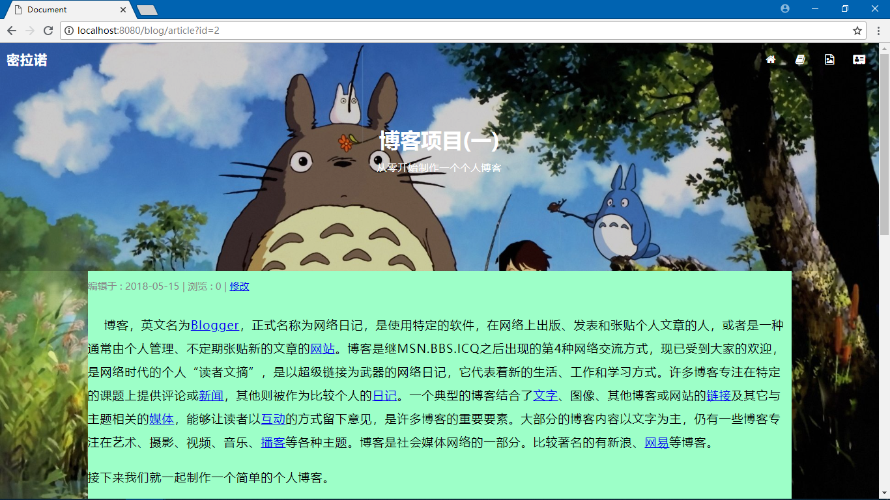
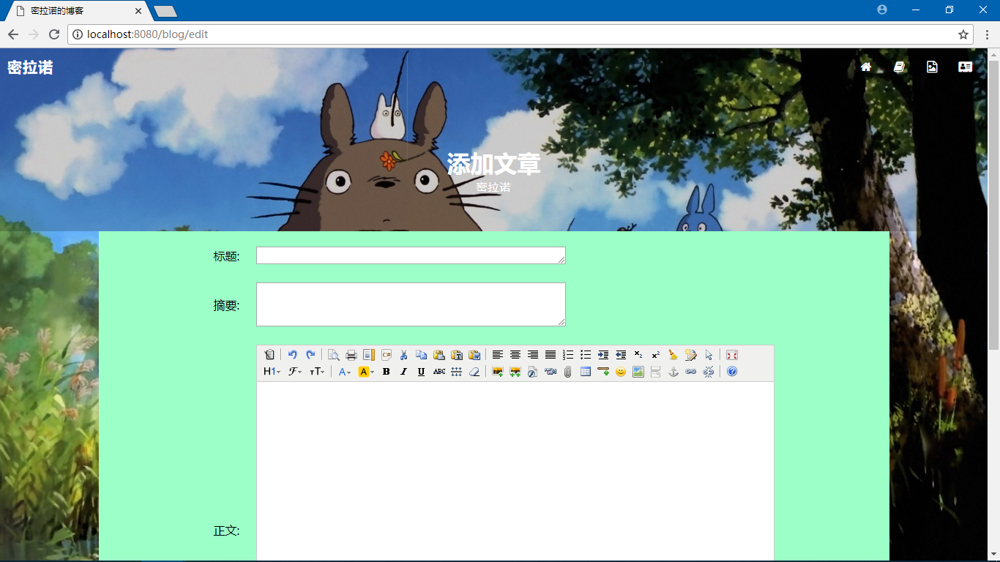
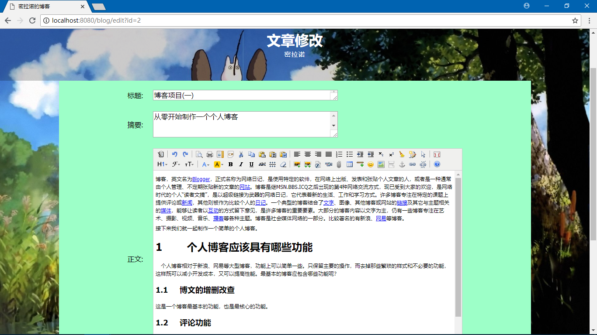

# Blog
spring + spring + springJDBC整合后的一个简单的博客

## 启动

- git clone https://github.com/0saber0/Blog
- 创建数据库：blog
- 导入建表脚本：blog.sql
- 部署项目（不带path）
- 访问 http://localhost:8080/blog/index

## 技术栈

- spring
- spring-mvc
- spring-jdbc
- mysql
- javascript
- freemarker

## 截图

